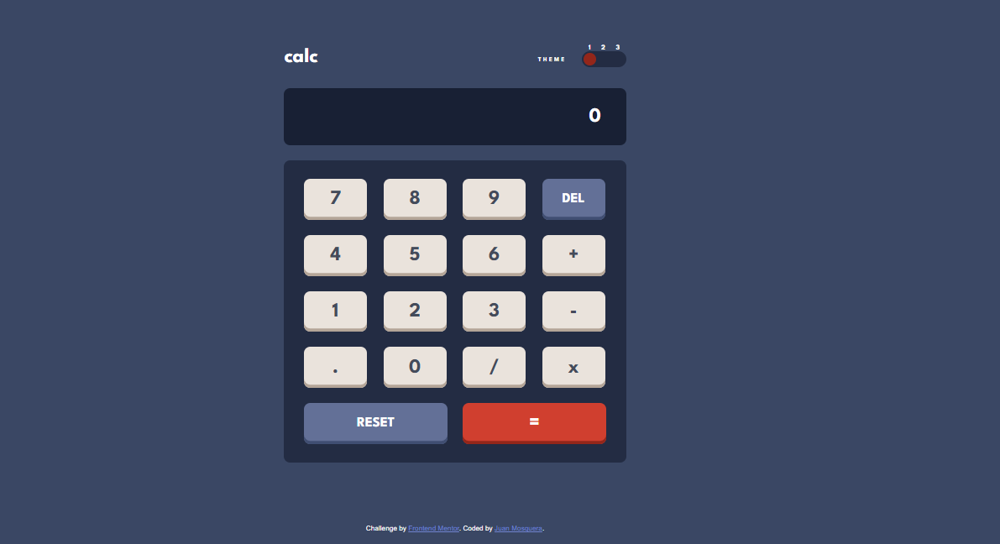
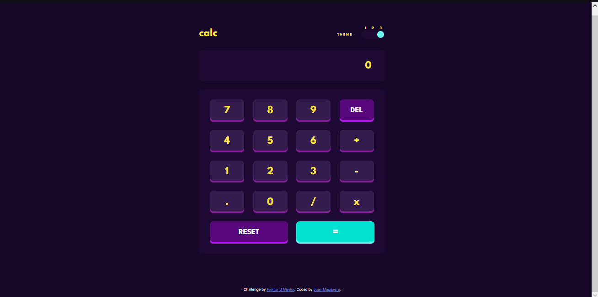

# Frontend Mentor - Calculator app solution

Esta es un solución para [Calculator app challenge on Frontend Mentor](https://www.frontendmentor.io/challenges/calculator-app-9lteq5N29). Los retos Frontend Mentor ayudan a mejorar las habilidades de codificación mediante la creación de proyectos realistas.

## Table of contents

- [Overview](#overview)
  - [The challenge](#the-challenge)
  - [Screenshot](#screenshot)
  - [Links](#links)
- [My process](#my-process)
  - [Built with](#built-with)
- [Author](#author)

## Overview

### The challenge 

Los usuarios deben ser capaces de:

- Vea cómo se ajusta el tamaño de los elementos según el tamaño de la pantalla de su dispositivo
- Realizar operaciones matemáticas como suma, resta, multiplicación y división.
- Ajuste el tema de color según su preferencia
- **Bonus**: verifique su preferencia de tema inicial usando `prefers-color-scheme` y guarde cualquier cambio adicional en el navegador

### Screenshot

### Links

- Solution URL: [Add solution URL here](https://your-solution-url.com)
- Live Site URL: [Add live site URL here](https://your-live-site-url.com)

## My process

### Built with

- Semantic HTML5 markup
- CSS custom properties
- Flexbox
- CSS Grid
- Mobile-first workflow
- [SASS](https://sass-lang.com) - For styles

## Author

- Linkedin - [Juan Mosquera](https://www.linkedin.com/in/juanmosquera98/)
- Frontend Mentor - [@yosoyteamc](https://www.frontendmentor.io/profile/Yosoyteamc)
- Instagram - [@yosoyteamc](https://www.instagram.com/yosoyteamc/)

